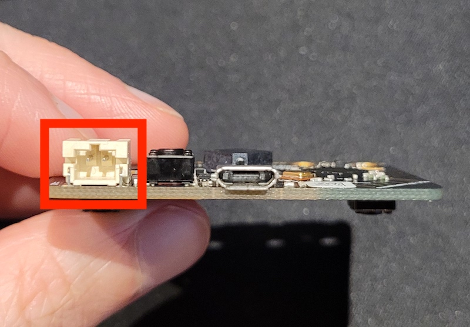

Για να εκτελέσετε το micro:bit σας χωρίς να είναι συνδεδεμένο στον υπολογιστή σας, θα χρειαστείτε την **θήκη μπαταριών** και **μπαταρίες** που συνοδεύουν το micro:bit.

### Σύνδεσε τις μπαταρίες

Βεβαιώσου ότι το πρόγραμμα που θέλεις να εκτελέσεις είναι στο micro:bit και ότι έχει δοκιμαστεί και, στη συνέχεια, αποσύνδεσε το καλώδιο micro USB από το micro:bit.

Τοποθέτησε τις μπαταρίες στη θήκη μπαταριών. Βεβαιώσου ότι έχεις ευθυγραμμίσει σωστά τις πλευρές «-» και «+» των μπαταριών.

Σύνδεσε την μπαταρία στη λευκή υποδοχή στην επάνω αριστερή γωνία του micro:bit.

Υπάρχει μια κορυφογραμμή στη μία πλευρά του βύσματος της μπαταρίας που θα εισχωρήσει στην αυλάκωση της υποδοχής micro:bit.

Το micro:bit θα πρέπει να ενεργοποιηθεί και να τρέξει το πρόγραμμα που κατέβασες σε αυτό.

Μπορείς να επαναφέρεις το micro:bit κάνοντας κλικ στο κουμπί δίπλα στην υποδοχή της μπαταρίας στο πίσω μέρος του micro:bit.

**Βεβαιώσου ότι έχεις αποσυνδέσει την μπαταρία προτού συνδέσεις ξανά το micro:bit στον υπολογιστή σου.**
