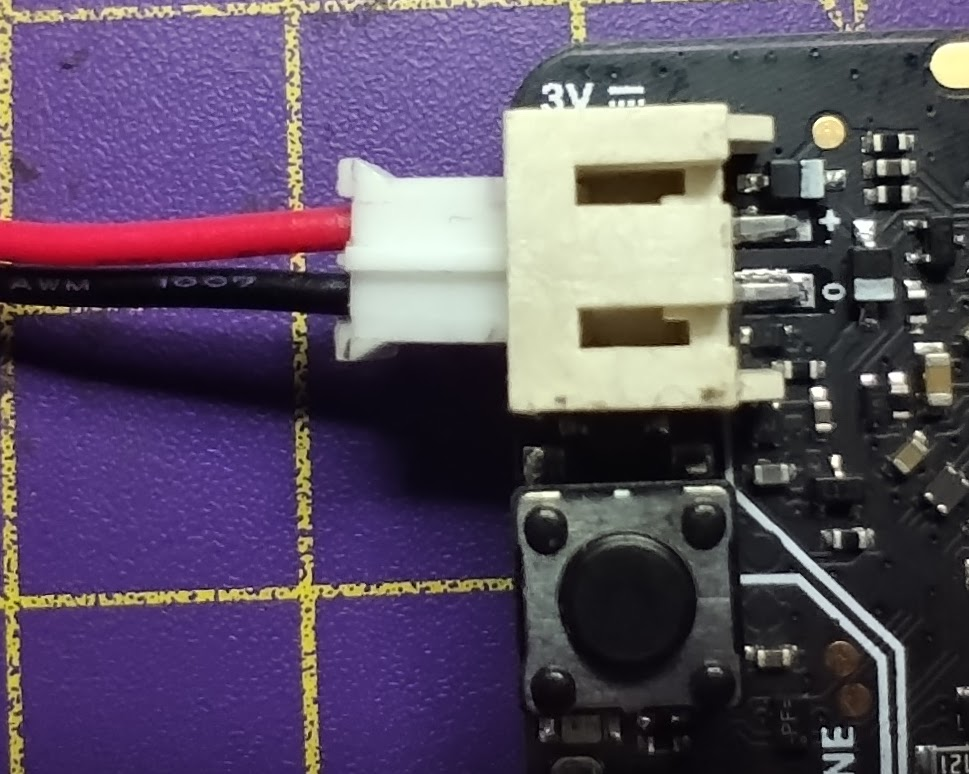
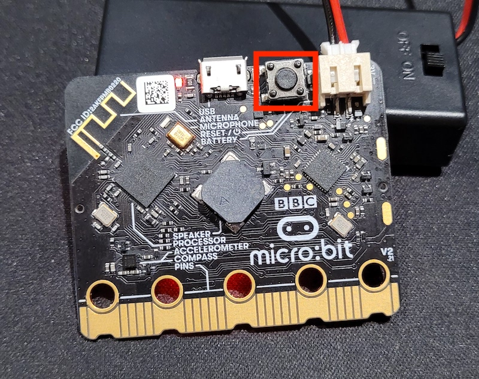

Pour faire fonctionner ton micro:bit sans qu'il soit connecté à ton ordinateur, tu auras besoin du **boîtier de piles** et des **piles** fournis avec ton micro:bit.

### Connecter les piles

Assure-toi que le programme que tu veux exécuter est sur le micro:bit et a été testé, déconnecte ensuite le câble micro USB du micro:bit.

Place les piles dans le boîtier de piles. Assure-toi d'aligner correctement les côtés `-` et `+` des piles.

Connecte le boîtier de piles au connecteur blanc dans le coin supérieur gauche du micro:bit.

Il y a une crête sur un côté du connecteur du boîtier de piles qui va se positionner dans la rainure du connecteur micro:bit.

Le micro:bit devrait s'allumer et exécuter le programme que tu as téléchargé.

Tu peux réinitialiser le micro:bit en cliquant sur le bouton à côté du connecteur du boîtier de piles à l'arrière du micro:bit.

**Assure-toi de déconnecter le boîtier de piles avant de rebrancher ton micro:bit à ton ordinateur.**
