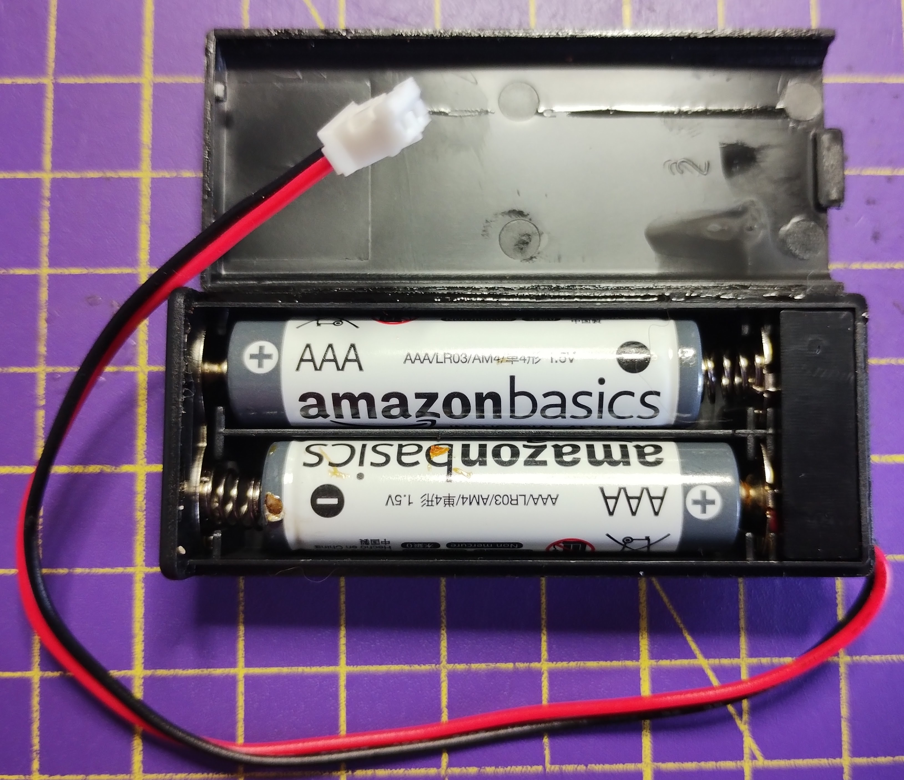

To run your micro:bit without it being connected to you computer, you will need the **battery pack** and **batteries** that came with your micro:bit.

### Connect the batteries

Make sure that the program you want to run is on the micro:bit and has been tested, then disconnect the micro USB cable from the micro:bit.

Place the batteries in the battery pack. Make sure you line up the `-` and `+` sides of the batteries correctly.

Connect the battery pack to the white connector in the top left corner of the micro:bit.

There is a ridge on one side of the battery pack connector that will slot into the groove on the micro:bit connector.

The micro:bit should power up, and run the program you downloaded to it.

You can reset the micro:bit by clicking the button next to the battery pack connector on the back of the micro:bit.

**Make sure to disconnect the battery pack before you plug your micro:bit back in to your computer.**
