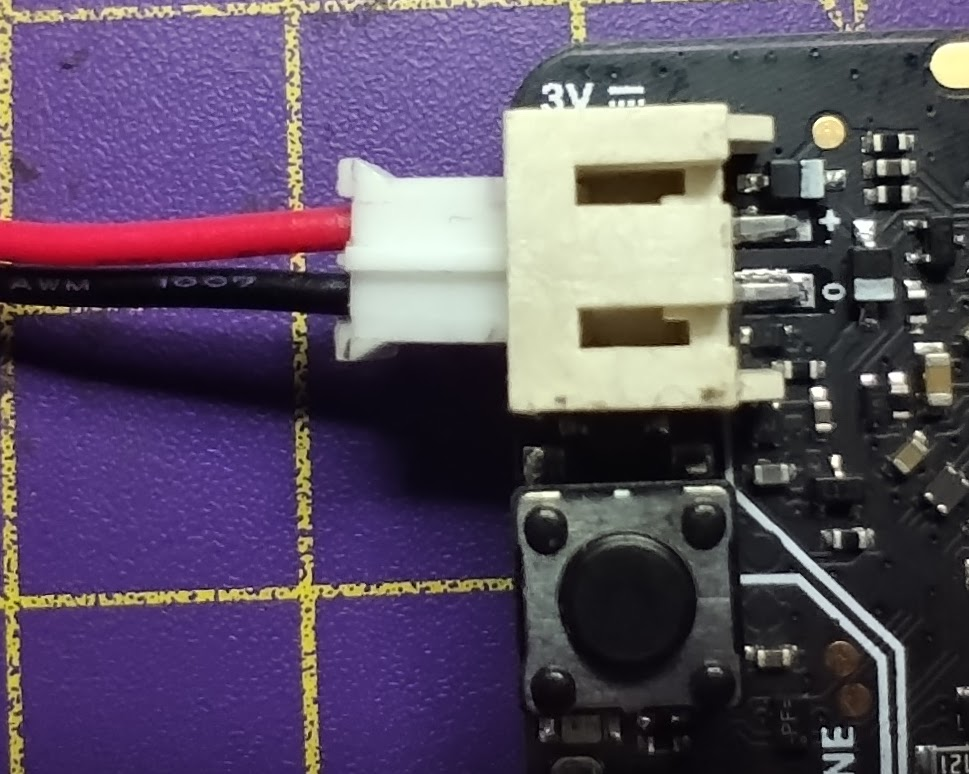
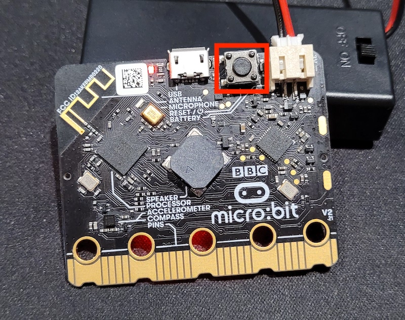

Om de micro:bit te laten werken zonder dat deze aangesloten is op je computer, heb je het **batterijpakket** en **batterijen** nodig dat bij je micro:bit werd geleverd.

### De batterijen aansluiten

Zorg ervoor dat het programma dat je wilt uitvoeren op de micro:bit staat en is getest, en koppel vervolgens de micro-USB-kabel los van de micro:bit.

Plaats de batterijen in het batterijpakket. Zorg ervoor dat je de `-` en `+` kanten van de batterijen correct plaatst.

Sluit het batterijpakket aan op de witte connector in de linker bovenhoek van de micro:bit.

Aan één kant van de batterijconnector bevindt zich een rand die in de groef op de micro:bit-connector past.

De micro:bit moet opstarten en het programma uitvoeren dat je hebt gedownload.

Je kunt de micro:bit resetten door op de knop naast de aansluiting van het batterijpakket te klikken op de achterkant van de micro:bit.

**Zorg ervoor dat je het batterijpakket loskoppelt voordat je je micro:bit weer aansluit op je computer.**
